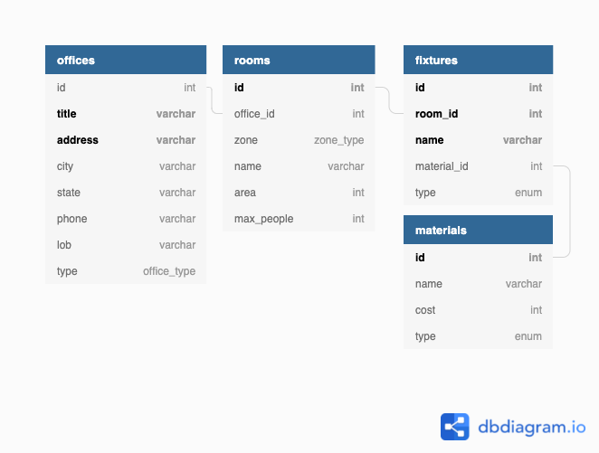

# Task 1
>The goal of this project is to create a  working Ruby based tool to import and store marketing materials information and provide different kinds of reports using HTML and CSS templates.

# Prerequisites
To install dependecies use bundler:  
```sh
bundle install
```

## Rack App
Starting from *Challenge 3* you can find `app` folder in repository. It contains a **Rack** app.  
To start the app use following commands in the `app` folder:  
```sh
rackup
```
After starting up it can be accesed on `127.0.0.1:9292` by default.

## Challenge 1
[Database Design Schema](https://dbdiagram.io/d/61852c5cd5d522682dfa5d50):




## Challenge 2
Script ```db_local.rb``` drops tables and dattatypes and then creates new. It expects that there is a database named ```task1``` with user ```ruby```.


## Challenge 3
Script ```load_local.rb``` loads `data.csv` file content to database. It expects that there is a database named ```task1``` with user ```ruby``` and file `data.csv` in working dir.  

In the web app you can find *Home* page. It contains link to the *Upload* page where you can select file to upload to the DB. You **must upload file after each rack app restart**, if you upload multiple times, only data from the the **last upload** will be left.


**NOTE:** all next challenge pages will work **only** with uploaded file.
## Challenge 4
If you open `reports/states` route, it should list all offices in each state in the database.  
Also you can view individual reports per state via following route:  `reports/states/<STATE_NAME>`.


## Challenge 5
If you open `/reports/offices/fixture_types` you will see Fixture Type Count report (how many different Fixture types exist per Office).  
Or you can view individual fixture type count reports per office on `/reports/offices/<OFFICE_ID>/fixture_types`.


## Challenge 6
You can open Marketing Materials Costs report on `/reports/material_cost`.

